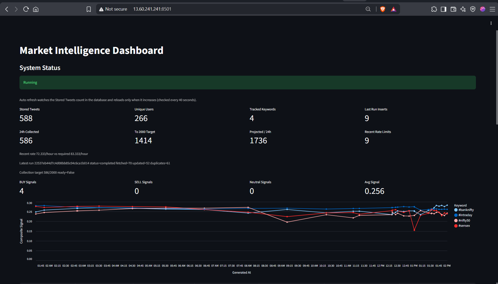
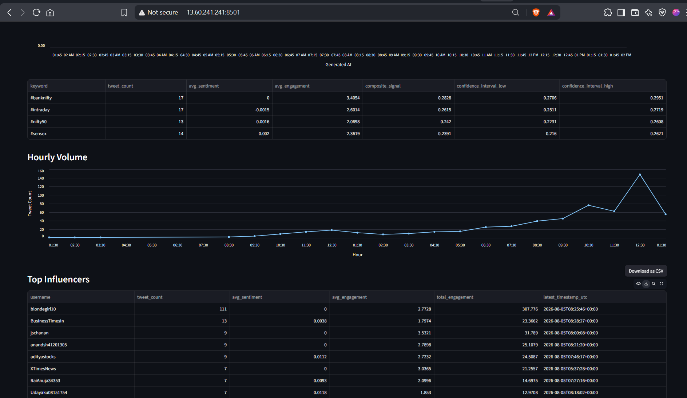
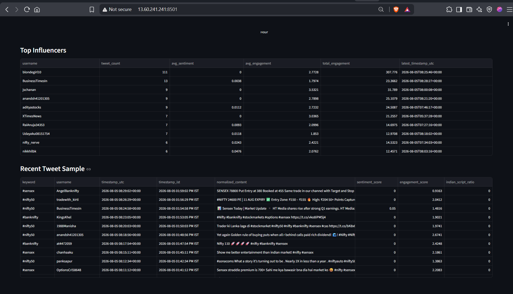

# Market Intelligence

Real-time market-intelligence system for Indian stock-market discussions on X.

This repository contains:

- a `twscrape`-based collector for `#nifty50`, `#sensex`, `#intraday`, and `#banknifty`
- a FastAPI service for health and status endpoints
- a Streamlit dashboard for live monitoring
- MongoDB-backed storage with deduplicating upserts
- parquet exports for downstream analysis
- text normalization, feature extraction, and signal aggregation
- monitoring jobs for watchdog and health-report emails

The current live deployment is hosted on AWS EC2.

## Recruiter Quick Start

The current recommended setup path is:

- Python virtual environment
- local MongoDB or MongoDB Atlas
- optional X credentials for live collection

### 1. Basic Runtime Requirements

| Component | Recommended |
| --- | --- |
| OS | Ubuntu 22.04+/24.04+, macOS, or Windows via WSL2 |
| Python | 3.12 recommended |
| Package installer | `pip` inside a virtual environment |
| Database | MongoDB Community or MongoDB Atlas |
| Optional live scrape auth | one valid X account/session |
| Optional monitoring email | Gmail SMTP app password |

Notes:

- The repo has been exercised on Python `3.12` locally and on Ubuntu server with Python `3.14`.
- The current public demo/server is hosted on AWS EC2.
- Python package versions are pinned in [`requirements.txt`](requirements.txt).
- For server deployment, keep using `.venv`; do not install Python dependencies globally.

### 2. Fastest Validation Path

If the reviewer only wants to verify code quality and local reproducibility without configuring X or MongoDB:

```bash
git clone https://github.com/mihirkate/market-intelligence.git
cd market-intelligence
python3 -m venv .venv
source .venv/bin/activate
pip install --upgrade pip
pip install -r requirements.txt
pytest -q
python -m compileall app tests run.py dashboard
```

This validates the codebase, tests, imports, and entrypoints without requiring live X credentials.

### 3. Full Local Run

For a full live run, the reviewer needs:

- a reachable MongoDB instance
- valid X credentials or session cookies for `twscrape`

Then:

```bash
cp .env.example .env
```

Update at least these values in `.env`:

```dotenv
MONGODB_URI=mongodb://localhost:27017/
MONGODB_DATABASE=market-intelligence
X_USERNAME=your_x_handle
X_AUTH_TOKEN=your_auth_token
X_CT0=your_ct0_token
```

Bootstrap the local `twscrape` account database and run the collector:

```bash
source .venv/bin/activate
python -m app.scraper.twscrape_setup
python -m app.scraper.account_status
python -m app.scraper.manager
python -m app.scraper.collection_status
```

Start the API and dashboard in two terminals:

```bash
source .venv/bin/activate
python run.py
```

```bash
source .venv/bin/activate
streamlit run dashboard/main.py --server.address 0.0.0.0 --server.port 8501
```

Then open:

- API: `http://127.0.0.1:8000/`
- Health: `http://127.0.0.1:8000/health`
- Dashboard: `http://127.0.0.1:8501/`

Current public deployment on AWS EC2 at the time of writing, if the server is still online:

- Health: `http://13.60.241.241:8000/health`
- Dashboard: `http://13.60.241.241:8501/`

Note: the public IP is environment-specific and may change later.

The dashboard summary cards stay Streamlit-rendered and the page reloads only when the stored tweet count in MongoDB increases.

## Detailed Guides

- Installation and setup: [`how_to_install.md`](how_to_install.md)
- Recruiter / reviewer test checklist: [`tests/HowToTest.md`](tests/HowToTest.md)
- Ubuntu deployment details: [`deploy/README.md`](deploy/README.md)

## Main Commands

```bash
python -m app.scraper.twscrape_setup
python -m app.scraper.account_status
python -m app.scraper.manager
python -m app.scraper.collection_status
python -m app.reporting.performance
python -m app.monitoring.watchdog_job
python -m app.monitoring.hourly_report_job
python -m app.scheduler.cron render
```

## Main Outputs

- raw fetched tweets: `data/raw/date=YYYY-MM-DD/`
- twscrape account DB: `data/twscrape/accounts.db`
- parquet tweets: `data/parquet/tweets/`
- parquet signals: `data/parquet/signals/`
- collection report: `reports/data_collection_status.json`
- processing report: `reports/processing_report.json`
- analysis report: `reports/analysis_summary.json`
- performance report: `reports/performance_benchmark.json`

## Live Scrape Notes

- This project does not use the paid X API.
- Live scraping requires a valid authenticated X session.
- If the account is rate-limited, the scraper stores cooldown metadata and exits cleanly.
- For better throughput toward the `2000 tweets / 24h` target, multiple X accounts are recommended.

## Monitoring Notes

Monitoring is optional for local evaluation. If configured, the repo can:

- send watchdog alerts when API or dashboard services become unhealthy
- send scheduled health-summary emails
- restart managed services on Ubuntu server deployments

SMTP is configured entirely through `.env`.

## Dashboard Preview

Primary dashboard overview with live collection progress and signal summary:



Signal, volume, and monitoring-focused dashboard view:



Recent tweet sample, influencer summary, and operational metrics view:


